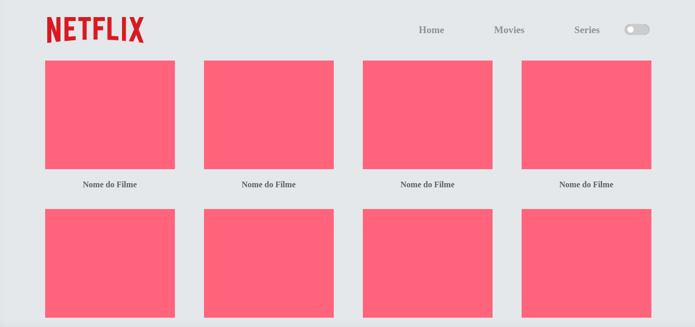
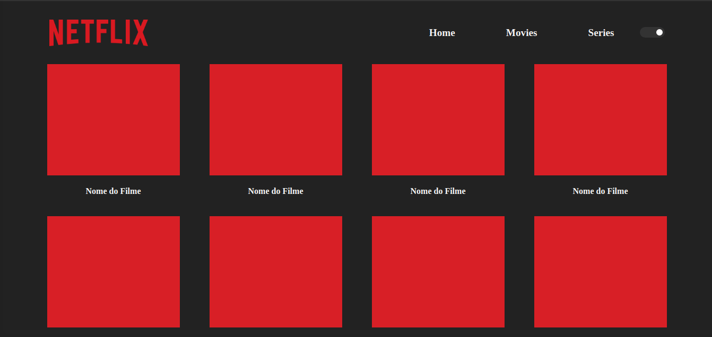

<h1 align="center">
    
     
    Netflix Dark Mode - CSS Variables
</h1>

<h4 align="center">
  Builded using CSS Variables and a little Javascript to manipulate DOM
</h4>

  <a href="#rocket-technologies">Technologies</a>&nbsp;&nbsp;&nbsp;|&nbsp;&nbsp;&nbsp;
  <a href="#information_source-demo">Demonstration</a>&nbsp;&nbsp;&nbsp;|&nbsp;&nbsp;&nbsp;
  <a href="#memo-license">License</a>

## :rocket: Technologies

This example was builded using HTML, CSS Variables, Local Storage and Javascript.

## :information_source: Demo

You can see this app in: https://patryckgratao.github.io/darkMode-CSS/

## :memo: License
This project is under MIT license.

---

Made with :heartpulse: by Patryck Gratão.